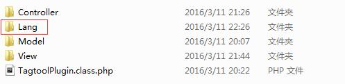
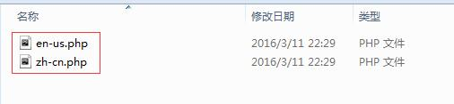

# 插件多语言

插件多语言,与正常应用一样,通过设置多语言文件来读取相应的国际语言字符串。

开启多语言的方法，可以参考TP官网关于多语言的说明。

[](http://document.thinkphp.cn/manual_3_2.html#language)

插件的多语言，首先建立多语言文件夹。


文件夹里面建立对应的多语言文件

编辑对应语言文件"zh-cn.php"、"en-us.php",语言文件采取数组结构采用返回数组方式：

```<?php

return array(
    'name'=>'标签云',
    'name_empty'=>'标签名字不能为空!',
);```

```<?php

return array(
    'name'=>'tagtool',
    'name_empty=>'tag name is invalid!',
);```

在写Model自动验证时就可以采用**{%lang_name_empty}**代替,模板里使用时,采用**{$Think.lang.lang_var}**