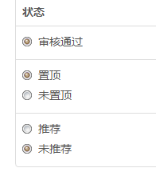

# 文章列表置顶功能制作

先在后台选择置顶功能



在模板的排序是用istop,post_modified降序
```html
<div class="">
    <php>
        $lists = sp_sql_posts_paged("cid:$cat_id;order:istop desc , post_modified desc;",10);
    </php>
    <volist name="lists['posts']" id="vo">
    <php>
        $smeta=json_decode($vo['smeta'], true);
    </php>

    <div class="list-boxes">
        <h2><a href="{:leuu('article/index',array('id'=>$vo['tid'],'cid'=>$vo['term_id']))}">{$vo.post_title}</a></h2>
        <p>{$vo.post_excerpt|msubstr=0,256}</p>
        <div>
            <div class="pull-left">
                <div class="list-actions">
                <a href="javascript:;"><i class="fa fa-eye"></i><span>{$vo.post_hits}</span></a>
                <a href="{:U('article/do_like',array('id'=>$vo['object_id']))}" class="js-count-btn"><i class="fa fa-thumbs-up"></i><span class="count">{$vo.post_like}</span></a>
                <a href="{:U('user/favorite/do_favorite',array('id'=>$vo['object_id']))}" class="js-favorite-btn" data-title="{$vo.post_title}" data-url="{:U('portal/article/index',array('id'=>$vo['tid']))}" data-key="{:sp_get_favorite_key('posts',$vo['object_id'])}">
                    <i class="fa fa-star-o"></i>
                </a>
                </div>
            </div>
            <a class="btn btn-warning pull-right" href="{:leuu('article/index',array('id'=>$vo['tid'],'cid'=>$vo['term_id']))}">查看更多</a>
        </div>
    </div>
    </volist>

</div>
```


